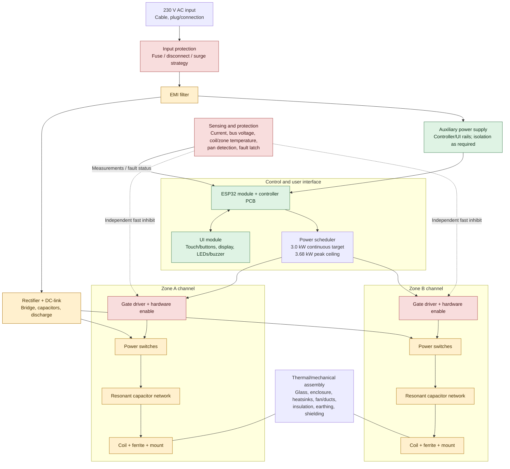

# PawPlate component block diagram

Decision-level architecture for a two-zone hob with **3.0 kW continuous total input target** and **3.68 kW peak input ceiling**. ESP32 is the chosen MCU family. Exact circuit topology and part numbers are not selected.

## Diagram

**Legend:** Green = likely available as standard module/component category; amber = standard parts exist, but application-specific selection/matching is needed; red outline = safety-critical function requiring deliberate design and validation. A colour is a sourcing hypothesis, not a design approval.

## Component sourcing map

| Block | Likely standardization route | Main open question |
|---|---|---|
| ESP32 controller | Standard ESP32 module on a project controller PCB | Which ESP32 variant meets timing, ADC and fault-interface needs? |
| UI | Off-the-shelf display, buttons/touch controller, LEDs and buzzer | Which UI form factor and communication interface? |
| Auxiliary supply | Certified isolated AC/DC module or a documented supply design | Which rails, isolation boundaries, thermal margin and standby consumption? |
| Input protection | Standard fuse, disconnect, surge and filter components | What ratings, coordination, inrush and installation requirements apply? |
| EMI filter | Standard filter components or a suitable existing filter assembly | Must be validated with the complete switching appliance and cable layout |
| Rectifier / DC link | Standard bridge, capacitor and discharge components | Bus voltage, ripple/inrush, energy storage, thermal and fault requirements |
| Power switches | Standard IGBTs or MOSFETs from established suppliers | Which device and topology fit resonant operation and switching losses? |
| Gate drivers | Standard driver IC/module families | Drive voltage, isolation, dead time, undervoltage and fault behaviour |
| Resonant capacitors | Standard high-frequency film capacitor families | Required capacitance, RMS current, pulse rating, temperature and lifetime |
| Coil + ferrite | Existing cooktop replacement/evaluation coil assembly, if documented | Inductance, geometry, ferrite, thermal limits and compatibility with the chosen inverter |
| Current/voltage sensing | Standard sensors, amplifiers and rated sensing components | Bandwidth, accuracy, isolation and independent fast-trip path |
| Temperature sensing | Standard NTCs or suitable temperature sensors | Sensor placement, response time and fail-safe interpretation |
| Cooling | Standard fans, heatsinks, thermal interface materials | Actual heat losses, airflow, noise, dust and service access |
| Mechanical assembly | Standard fasteners, wire, connectors where appropriately rated | Custom geometry likely required for coil/glass spacing, enclosure and shielding |
| Firmware/protection logic | ESP-IDF and documented software interfaces | Firmware must not be the only means of stopping dangerous switching |

## Decisions this diagram enables

1. **Coil sourcing:** seek an existing cooking coil assembly with real technical documentation before designing a winding.
2. **Power topology:** compare single-switch quasi-resonant and half-bridge series-resonant designs; the topology determines switch, driver, capacitor, sensing and control requirements.
3. **Power architecture:** decide whether the zones share a rectified DC link and which parts of that link can sensibly be shared.
4. **Controller boundary:** ESP32 supervises the appliance; fast overcurrent/fault shutdown must inhibit the drivers through a hardware path independent of application scheduling.
5. **Standard interfaces:** define voltage/current ranges, isolation domain, connector pinout, fault states and mounting interfaces before choosing connector families.

## Important constraints

- The 3.0 kW continuous target and 3.68 kW peak ceiling are **total appliance input** targets, including both zones and auxiliary loads—not per-zone output ratings.
- The 3.68 kW peak target assumes a suitable 230 V / 16 A supply and does not guarantee every household circuit can support it.
- Standard component categories do not automatically make the resulting power stage interchangeable or safe. The coil, resonant network, switches, gate driver, sensing and control are a coupled system.
- This is a conceptual diagram for component decisions, not a mains wiring diagram or a build-ready design.
