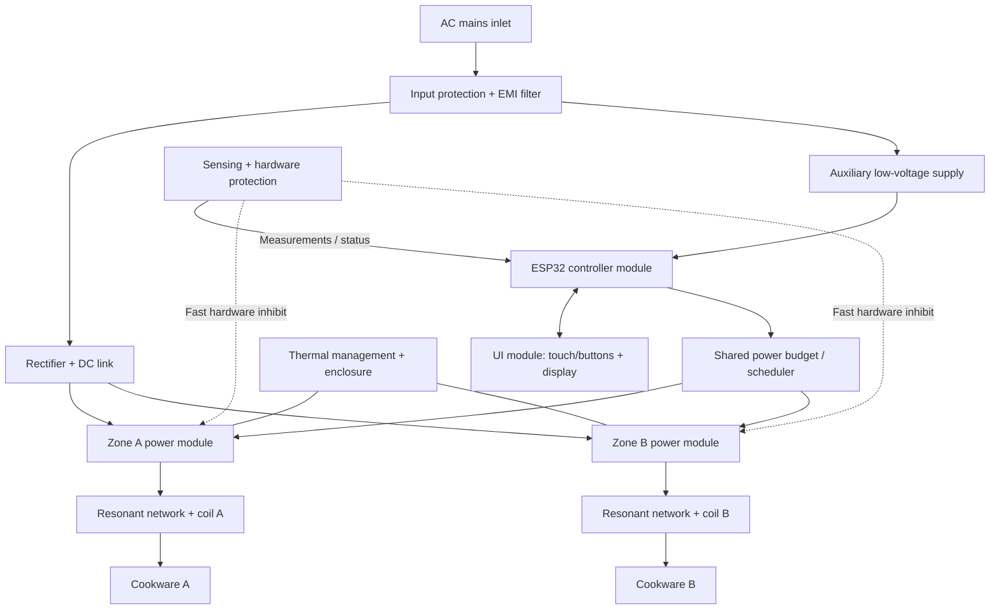

# Architecture research survey (initial pass)

Date: 2026-10-09

## Scope and conclusion

This is a first-pass survey for PawPlate, a proposed low-cost, two-zone built-in induction hob. The project has chosen the ESP32 family as its main microcontroller and wants modular, standardized parts. No hardware was opened or modified for this research.

The literature supports separating the appliance into mains/DC-link, resonant power conversion, coil/resonant network, sensing/protection, controller, UI, auxiliary supply and thermal/mechanical subsystems. A sensible initial logical model is two zone power channels under one supervisory controller and shared power budget. This does **not** yet determine whether both zones share a DC link, whether each has its own inverter PCB, or which resonant topology is best.

## Sources and what they contribute

1. **Infineon, Smart Induction Cooktop Reference Design user guide (2024).**  
   https://www.infineon.com/dgdl/Infineon-UG-2024-05-Smart-Induction-Cooktop-UserManual-v01_00-EN.pdf?fileId=8ac78c8c8e7ead30018e85ee55c8191a  
   Manufacturer reference design. Its described inverter board includes current sensing for pan detection/current measurement/overcurrent, a bridge rectifier, MCU, IGBT and gate driver, and a resonant circuit made from the coil and capacitor. The reference uses a PSoC MCU, not ESP32; its functional partitioning is informative, not code-compatible by default.

2. **Infineon, AN 2014-01: Reverse-conducting IGBTs for induction cooking and resonant applications.**  
   https://www.infineon.com/assets/row/public/documents/60/42/infineon-an2014-01-reverse-conducting-igbt-applicationnotes-en.pdf  
   Background on induction heating, coil/ferrite arrangement, quasi-resonant and half-bridge series-resonant topologies, switching devices and thermal/switching trade-offs. The note describes typical household cooking inverter frequencies in the tens of kilohertz; actual operating range depends on topology and load.

3. **Infineon, Induction cooking overview and product-selection guide.**  
   https://www.infineon.com/applications/consumer-electronics/home-appliances/induction-cookers  
   https://www.infineon.com/assets/row/public/documents/24/66/infineon-product-selection-guide-home-appliances-2025-productselectionguide-en.pdf  
   Contrasts single-switch quasi-resonant designs, often used in lower-power single-zone products, with half-bridge current-resonant designs used in higher-power/multi-zone cooking appliances. This is a trade-off reference, not a final topology selection.

4. **Espressif, ESP32 MCPWM documentation.**  
   https://docs.espressif.com/projects/esp-idf/en/stable/esp32/api-reference/peripherals/mcpwm.html  
   https://docs.espressif.com/projects/esp-idf/en/latest/esp32/api-reference/peripherals/mcpwm/mcpwm_fault.html  
   MCPWM offers timed waveform generation and hardware fault/brake functions. Whether a particular ESP32 variant has enough appropriate resources and timing performance must be checked. A peripheral fault response is useful but does not remove the need for independently engineered hardware protection.

5. **Open-source project: ReactorForge.**  
   https://github.com/ThingEngineer/ReactorForge  
   Publishes hardware designs, schematics and firmware for a high-power induction-heating platform. It is aimed at industrial-style induction heating rather than a domestic cooking appliance. Useful as an example of open hardware documentation and resonant-inverter control, not a ready-to-copy hob design.

6. **IEC 60335-2-6:2024, household stationary cooking appliances.**  
   https://webstore.iec.ch/en/publication/65424  
   Relevant appliance-safety standard family covering stationary cooking ranges and hobs, including induction hobs. The exact applicable edition, national adoption, and conformity route must be confirmed for the intended product and market.

7. **European Commission, hobs and ecodesign.**  
   https://energy-efficient-products.ec.europa.eu/product-list/hobs_en  
   The Commission identifies domestic hobs as in scope of Ecodesign Regulation (EU) No 66/2014 and notes standby requirements under Regulation (EU) 2023/826. This is separate from electrical safety and EMC compliance.

## Initial architectural implications

- **ESP32 is the supervisory controller.** Use it for UI, operating state, power scheduling, diagnostics and control algorithms once timing and protection partitioning have been validated.
- **Fast protection is a separate path.** Overcurrent and other critical faults should be able to inhibit switching in hardware without waiting for an application task, network stack or display code. Firmware should record the fault and manage recovery only after the hardware has reached a safe state.
- **Each zone is a replaceable functional channel.** Each needs a coil and resonant network, switching devices and driver, feedback sensing, temperature monitoring and a defined interface to the shared controller/power budget.
- **The mains/DC-link subsystem is shared infrastructure.** Input protection, EMI filtering, rectification, energy storage and auxiliary supplies need explicit boundaries and safety review. Shared infrastructure does not mean these circuits are low-risk or plug-and-play.
- **UI is a separate low-voltage module.** Touch controls/display/indicators should communicate through a documented interface and must not be able to defeat safety interlocks.
- **Thermal and mechanical design are core subsystems.** Coil alignment, ferrite, spacing, airflow, heatsinking, glass support, enclosure, insulation, protective earthing and EMC all affect the electrical design.
- **Standardize interfaces before over-standardizing parts.** Document connector pinouts, voltage/current limits, isolation domain, signal direction, fault states and environmental limits. Avoid selecting a connector solely because it is common in hobby electronics.
- **Keep both zones under a total input-power limit.** The appliance-level scheduler should allocate power based on the defined mains/input limit and thermal constraints. Exact limits are TBD.

## Proposed high-level diagram

Diagram is conceptual: it does not specify a circuit, safety isolation scheme, connector pinout or build-ready design.

## Next research tasks

1. Compare single-switch quasi-resonant and half-bridge series-resonant options for the target power and two-zone use.
2. Define a preliminary power budget from the reference appliance, with the rating verified against manufacturer documentation.
3. Select candidate ESP32 variants only after mapping PWM/timing, ADC, watchdog and fault-input needs.
4. Create a module-interface table with signal types, safety domains, connectors and fault-state behaviour.
5. Build a safety/compliance matrix covering electrical shock, fire, hot surfaces/residual heat, cookware detection, abnormal operation, EMC and standby/energy requirements.
6. Model the control and resonant stages in simulation before any physical power-stage work.
